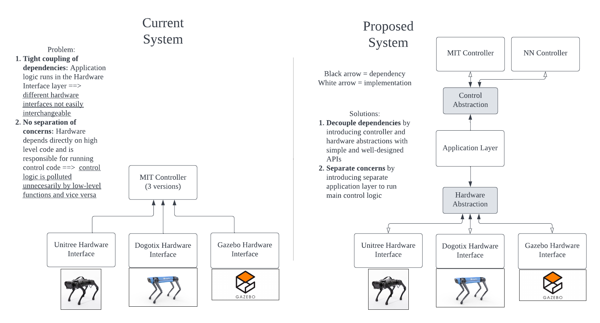
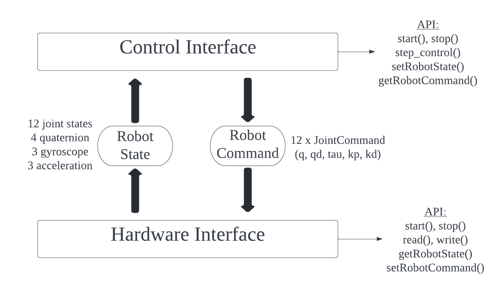

# Modular Control Architecture

This repo aims to design a unified and modular control architecture that enables easy interchanging of high-level controllers and low-level hardware. 


## Design

### Motivation


### API

The API for the controller and hardware interfaces is defined in `interfaces` 



### Example Application

Using this architecture, control and hardware construction and initialization details are abstracted away and hidden behind simple interfaces. 

```
    auto hardware = FakeHardware();
    auto controller = FakeController();
    hardware.start();
    controller.start();

    // Initialize static memory
    static interfaces::RobotState robotState; 
    static interfaces::RobotCommand robotCommand;
```

The control loop can be compactly defined in about 10 lines of code. 

```
    // Implement control loop
    while (true)
    {
        // Communicate robot state from hardware to controller
        hardware.read();
        hardware.getRobotState(robotState);
        controller.setRobotState(robotState);
        // Compute control command
        controller.step_control();
        // Communicate robot command from controller to hardware
        controller.getRobotCommand(robotCommand);
        hardware.setRobotCommand(robotCommand);
        hardware.write();
    }
```

## Roadmap

- [x] Design interfaces
- [x] Implement example dummy hardware and controller
- [x] Implement Unitree hardware 
- [ ] Implement example controller
- [ ] Verify that full control setup works on hardware

## Quickstart

### Install Dependencies (Docker)
This repository comes bundled with a Docker development container that bundles the dependencies necessary to build the project. It can be opened using VSCode Remote Containers extension

### Build Executables

```
mkdir build
cd build
cmake ..
make 
```

`examples/fake_application` demonstrates how to implement a simple application with dummy controller and hardware. 
